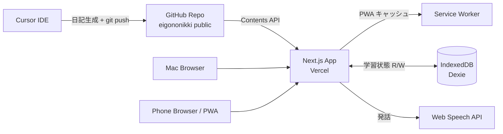
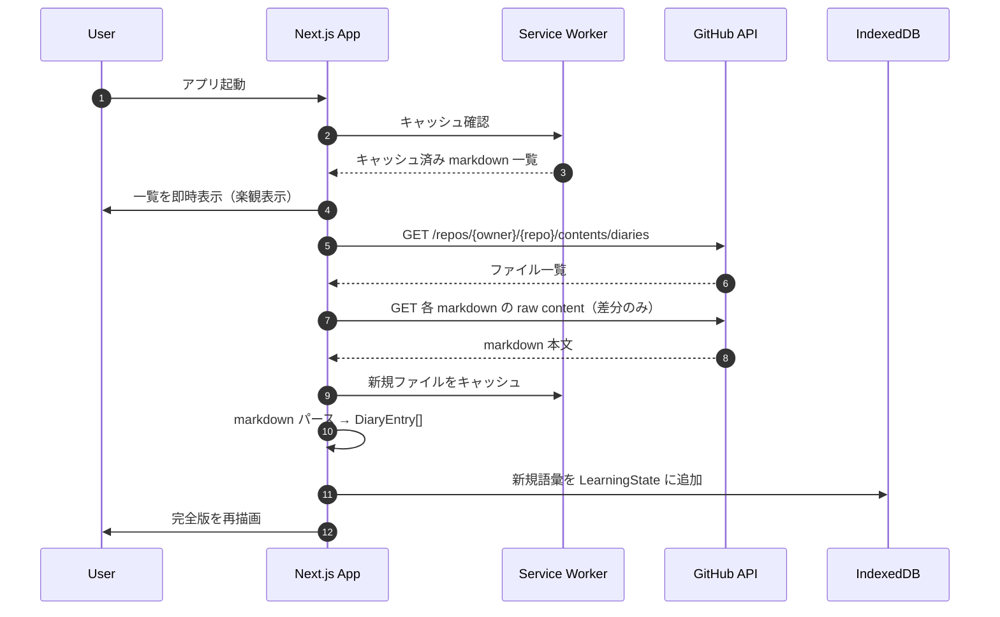
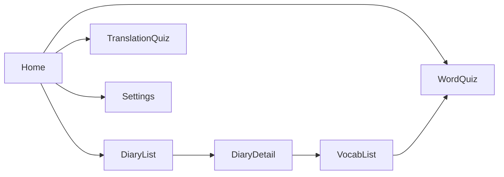
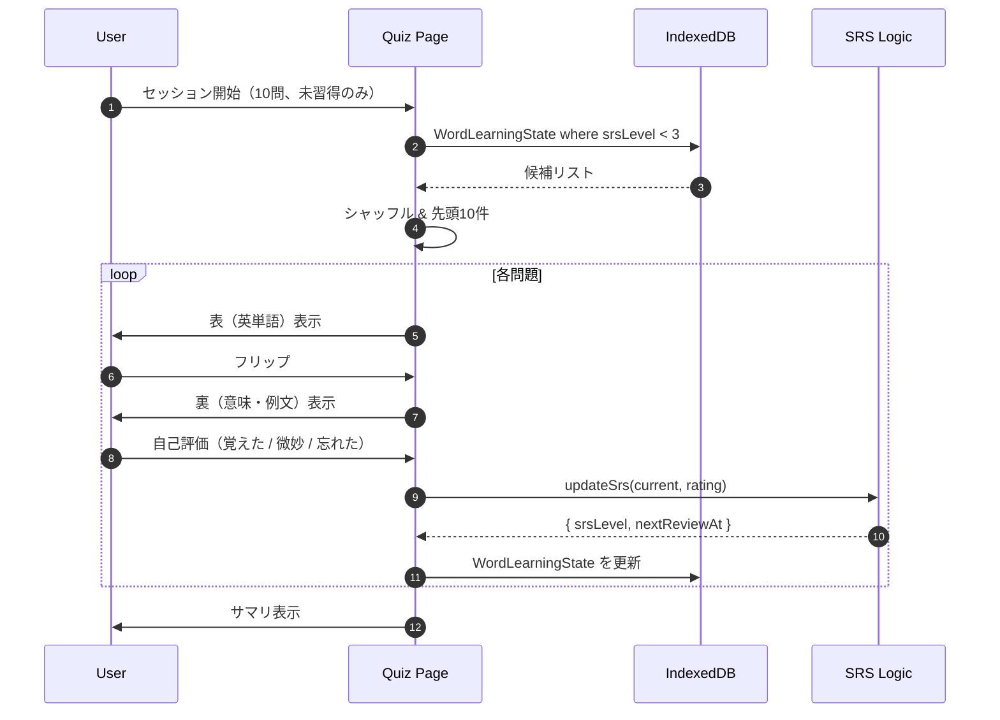
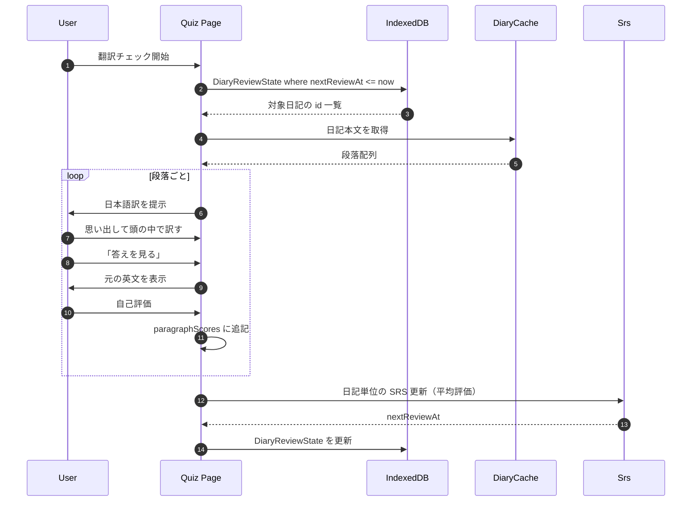

# アプリ設計書 — Eigononikki Web/PWA アプリ

> このドキュメントは、[`requirements.md`](requirements.md) で定義した要件を実装に落とすための **設計書** です。
> 実装開始時は [`kickoff-prompt.md`](kickoff-prompt.md) を新プロジェクトの Cursor に貼ってください。

---

## 1. 技術スタック

### 1.1 推奨スタック

| レイヤ | 採用技術 | 理由 |
| --- | --- | --- |
| フロントエンド | **Next.js 15 (App Router) + TypeScript** | RSC とクライアントコンポーネントの使い分けが学習しやすい、Vercel デプロイがシームレス |
| スタイル | **Tailwind CSS** | UX デザイナー視点での微調整がしやすい、shadcn/ui との相性が良い |
| UI コンポーネント | **shadcn/ui** | コピペで持ってこられ、必要に応じて自分仕様に書き換えられる |
| 状態管理 | **React Context + useReducer**（必要に応じ **Zustand**） | 規模的に Redux 等は過剰 |
| データ取得 | **GitHub Contents API**（fetch ベース） | public repo は認証不要、SDK 不要 |
| markdown パース | **gray-matter** + **remark** + **remark-gfm** + **remark-parse** | GFM テーブル対応、AST 経由で構造抽出が安全 |
| ローカル DB | **Dexie.js**（IndexedDB ラッパ） | IndexedDB を Promise ベースで扱える、型定義が綺麗 |
| TTS | **Web Speech API**（`SpeechSynthesisUtterance`） | 追加コストゼロ、端末標準音声 |
| PWA | **`@ducanh2912/next-pwa`** または **App Router 標準 manifest + 自作 SW** | オフラインキャッシュとホーム画面追加 |
| デプロイ | **Vercel** | 無料、PR プレビュー、Edge Functions 不使用なら完全無料枠内 |
| テスト | **Vitest** + **React Testing Library**（必要箇所のみ） | markdown パース・SRS ロジックは単体テスト必須 |

### 1.2 採用しないもの（理由）

| 不採用 | 理由 |
| --- | --- |
| Redux / RTK | この規模では過剰 |
| GraphQL | 単一外部 API（GitHub）のみで、シンプルな fetch で十分 |
| バックエンド（Node / Go 等） | 学習データはローカル完結、生成は Cursor 側で行うため不要 |
| 認証ライブラリ（NextAuth 等） | ひとり利用、認証なし |

---

## 2. システム全体像

### 2.1 全体構成図



### 2.2 データの流れ（起動時）



---

## 3. データモデル

### 3.1 メモリ上のドメインモデル（markdown 由来 / 読み取り専用）

```typescript
type Phase = 1 | 2 | 3;

interface DiaryEntry {
  id: string;              // ファイル名から（例: "2026-05-25" or "2026-05-25-2"）
  date: string;            // ISO 8601 形式 (YYYY-MM-DD)
  variant?: number;        // 同日複数時の枝番（-2 → 2）
  title: string;           // H1 から抽出
  topic: string;           // > Topic: ... から
  mode: Phase;             // > Mode: Phase X (...) から
  englishParagraphs: string[];   // "## English" 配下を段落分割
  japaneseParagraphs: string[];  // "## 日本語訳" 配下を段落分割
  patterns: PatternNote[];       // "## 写経のポイント" の箇条書き
  vocabulary: VocabularyItem[];  // "## Vocabulary" のテーブル行
  rawMarkdown: string;     // 元文字列（再パース用）
  sha: string;             // GitHub blob SHA（差分検出用）
}

interface PatternNote {
  expression: string;      // 太字部分
  note: string;            // 日本語の説明
}

interface VocabularyItem {
  word: string;            // "Word / phrase" 列
  partOfSpeech: string;    // "品詞" 列
  meaning: string;         // "意味" 列
  exampleUsage: string;    // "例文での使われ方" 列
  sourceDiaryId: string;   // どの DiaryEntry から来たか
}
```

### 3.2 IndexedDB スキーマ（学習状態 / 永続）

Dexie.js で定義する 4 テーブル。

```typescript
import Dexie, { type Table } from "dexie";

interface DiaryCache {
  id: string;              // 主キー: DiaryEntry.id
  date: string;
  sha: string;             // GitHub blob SHA
  rawMarkdown: string;
  fetchedAt: number;       // unix ms
}

interface WordLearningState {
  id: string;              // 主キー: 正規化された word (lowercase + trim)
  displayWord: string;     // 表示用（元の表記）
  meaning: string;         // 最新の意味（複数出典の場合は最初のもの）
  partOfSpeech: string;
  occurrences: WordOccurrence[];  // 出現履歴
  srsLevel: number;        // 0-5（0=未学習）
  nextReviewAt: number;    // unix ms
  lastReviewedAt: number | null;
  correctCount: number;
  wrongCount: number;
  createdAt: number;
}

interface WordOccurrence {
  diaryId: string;
  exampleUsage: string;
  addedAt: number;
}

interface DiaryReviewState {
  diaryId: string;         // 主キー
  lastTranslationAttemptAt: number | null;
  nextReviewAt: number;    // unix ms（翻訳チェックの次回推奨日）
  paragraphScores: ParagraphScore[];  // 段落単位の自己評価履歴
  srsLevel: number;        // 0-5
}

interface ParagraphScore {
  paragraphIndex: number;
  score: "remembered" | "vague" | "forgot";
  scoredAt: number;
}

interface AppSettings {
  key: string;             // 主キー: "github_repo" など
  value: string;
}

class AppDB extends Dexie {
  diaryCache!: Table<DiaryCache, string>;
  wordLearningState!: Table<WordLearningState, string>;
  diaryReviewState!: Table<DiaryReviewState, string>;
  appSettings!: Table<AppSettings, string>;

  constructor() {
    super("eigononikki");
    this.version(1).stores({
      diaryCache: "id, date, sha",
      wordLearningState: "id, srsLevel, nextReviewAt, lastReviewedAt",
      diaryReviewState: "diaryId, nextReviewAt, srsLevel",
      appSettings: "key",
    });
  }
}
```

### 3.3 マイグレーション戦略

- スキーマ変更時は Dexie の `version(N+1).stores(...).upgrade(tx => ...)` で対応
- 破壊的変更時は「設定 → エクスポート」で JSON バックアップを促す UI を用意

---

## 4. markdown パース仕様

既存の `diaries/YYYY-MM-DD.md` の構造に依存するため、**仕様として固定** する。

### 4.1 期待する構造（Phase 1 を例に）

```markdown
# YYYY-MM-DD — [Title]

> Topic: [topic text]
> Mode: Phase 1 (写経 / Copying)

## English

[paragraph 1]

[paragraph 2]
...

## 日本語訳

[paragraph 1]

[paragraph 2]
...

## 写経のポイント / Patterns to notice

- **[expression]** — [日本語ノート]
- ...

## Vocabulary

| Word / phrase | 品詞 | 意味 | 例文での使われ方 |
| --- | --- | --- | --- |
| ... | ... | ... | ... |
```

### 4.2 抽出ルール

| フィールド | 抽出方法 |
| --- | --- |
| `title` | 最初の `# ` の右側（` — ` で区切られた後半をタイトル、前半を日付として検証） |
| `date` | ファイル名 `YYYY-MM-DD(-N)?.md` の `YYYY-MM-DD` 部分 |
| `variant` | ファイル名に `-N` があれば N、なければ undefined |
| `topic` | 最初の blockquote ブロック内の `Topic:` で始まる行の右側 |
| `mode` | 同じ blockquote 内の `Mode: Phase X` の X を 1\|2\|3 にパース |
| `englishParagraphs` | `## English` の次から、次の `##` 直前までを段落（空行区切り）で分割 |
| `japaneseParagraphs` | `## 日本語訳` の次から、次の `##` 直前まで |
| `patterns` | `## 写経のポイント` 配下の `- ` リスト。`**...**` 部分を `expression`、残りを `note`（前後の `—` などは trim） |
| `vocabulary` | `## Vocabulary` 配下の GFM テーブル本文行を 4 列にマップ |

### 4.3 Phase 2 / 3 の扱い

**Phase 2 対応済み（2026-06-24 実装）**

Phase 2 の markdown 構造:

```markdown
## Fill in the blanks      ← 穴あき本文（fillInBlanksText に格納）
## Hints (日本語)          ← ヒント（パース対象外、rawMarkdown から参照）
## Full diary (clean version)  ← クリーン英文 → englishParagraphs に格納（TTS 用）
## Vocabulary              ← 穴埋め語を中心とした語彙テーブル
## 日本語訳                ← japaneseParagraphs に格納
```

- `englishParagraphs`: `## Full diary (clean version)` から抽出（`## English` の代替）
- `fillInBlanksText?: string[]`: `## Fill in the blanks` から抽出（Phase 2 専用フィールド）
- `patterns`: 空配列（Phase 2 には `## 写経のポイント` なし）
- `vocabulary`: 穴埋め語を中心に通常通り抽出

Phase 3（自由作文）: 構造が想定外の場合は `englishParagraphs` を空配列にし、UI で「このフォーマットは未対応」と表示

### 4.4 パース実装方針

```typescript
import { unified } from "unified";
import remarkParse from "remark-parse";
import remarkGfm from "remark-gfm";
import type { Root, Heading, Paragraph, Table, List, Blockquote } from "mdast";

function parseDiary(rawMarkdown: string, fileName: string): DiaryEntry {
  const tree = unified().use(remarkParse).use(remarkGfm).parse(rawMarkdown) as Root;
  return {
    id: extractIdFromFileName(fileName),
    date: extractDateFromFileName(fileName),
    variant: extractVariantFromFileName(fileName),
    title: extractTitle(tree),
    topic: extractFromBlockquote(tree, "Topic"),
    mode: extractPhaseFromBlockquote(tree),
    englishParagraphs: extractSectionParagraphs(tree, "English"),
    japaneseParagraphs: extractSectionParagraphs(tree, "日本語訳"),
    patterns: extractPatterns(tree),
    vocabulary: extractVocabulary(tree, extractIdFromFileName(fileName)),
    rawMarkdown,
    sha: "", // 呼び出し側で set
  };
}
```

### 4.5 単語の正規化（重複統合のためのキー）

```typescript
function normalizeWord(word: string): string {
  return word
    .toLowerCase()
    .trim()
    .replace(/\s+/g, " ");
}
```

- 句動詞・コロケーション（`fade into`, `soften the edges`）は連続スペースを単一化して比較
- 大文字小文字は無視
- 末尾の記号（`,`, `.`, `:` 等）は除去
- **将来課題**: 活用形（`hummed` → `hum`）の正規化は MVP では行わない（誤マージリスクを避ける）

---

## 5. SRS（Spaced Repetition）アルゴリズム

### 5.1 採用案: SM-2 簡易版

| SRS Level | 次回復習までの間隔 |
| --- | --- |
| 0 | 当日（未学習） |
| 1 | 1 日後 |
| 2 | 3 日後 |
| 3 | 7 日後 |
| 4 | 14 日後 |
| 5 | 30 日後 |

評価入力に応じてレベル変動:

| 評価 | レベル変動 |
| --- | --- |
| 覚えた（remembered） | +1（上限 5） |
| 微妙（vague） | 維持 |
| 忘れた（forgot） | 0 にリセット |

```typescript
const INTERVALS_DAYS = [0, 1, 3, 7, 14, 30];

function updateSrs(
  current: { srsLevel: number },
  rating: "remembered" | "vague" | "forgot",
  now = Date.now()
): { srsLevel: number; nextReviewAt: number } {
  let nextLevel = current.srsLevel;
  if (rating === "remembered") nextLevel = Math.min(5, current.srsLevel + 1);
  else if (rating === "forgot") nextLevel = 0;

  const intervalMs = INTERVALS_DAYS[nextLevel] * 24 * 60 * 60 * 1000;
  return { srsLevel: nextLevel, nextReviewAt: now + intervalMs };
}
```

> ~~TBD-2~~ **確定**: 「3 段階入力（覚えた / 微妙 / 忘れた）+ SM-2 風スケジュール」のハイブリッドを採用。

---

## 6. 画面構成

### 6.1 ルーティング（Next.js App Router）

```
src/app/
├── layout.tsx                       共通レイアウト、ナビ、Provider
├── page.tsx                         Home（今日のおすすめ）
├── diaries/
│   ├── page.tsx                     Diary List
│   └── [id]/page.tsx                Diary Detail
├── vocabulary/
│   └── page.tsx                     Vocabulary List
├── quiz/
│   ├── words/page.tsx               Word Quiz
│   └── translation/page.tsx         Translation Quiz
└── settings/page.tsx                Settings
```

### 6.2 画面ごとの主な要素

#### Home（`/`）

- 今日のおすすめアクション（カード 3 枚）
  - 「最新の日記を写経する」→ Diary Detail
  - 「復習推奨の単語 N 個」→ Word Quiz
  - 「翻訳チェック推奨の日記 M 件」→ Translation Quiz
- 最近の日記 3 件
- 簡易統計（累計日記数、覚えた語数、連続日数）

#### Diary List（`/diaries`）

- 検索ボックス（タイトル / Topic / 本文）
- フィルタ（Phase 1/2/3、月別）
- 日記カード一覧（日付・タイトル・Topic・Phase バッジ）

#### Diary Detail（`/diaries/[id]`）

- ヘッダ（日付・タイトル・Topic・Phase バッジ）
- TTS コントロール（再生 / 一時停止 / 次の文 / ループ / 速度 / 音声）
- 英文表示（読み上げ中の段落／文をハイライト）
- 日本語訳（折りたたみ可、デフォルト展開）
- 写経のポイント
- Vocabulary テーブル（単語タップで個別 TTS）

#### Vocabulary List（`/vocabulary`）

- 検索 / フィルタ（品詞、習得度、未習得のみ）
- ソート（初出日、出現回数、習得度）
- 単語カードまたは表示モード切替

#### Word Quiz（`/quiz/words`）

- セッション開始設定（出題方向、出題対象、問題数）
- フラッシュカード UI（表 → 裏フリップ）
- 自己評価ボタン（覚えた / 微妙 / 忘れた）
- 終了サマリ（正答率、新規習得語）

#### Translation Quiz（`/quiz/translation`）

- 復習対象日記の選択（自動 or 手動）
- 段落単位の出題（日本語 → 英語）
- 「正解を見る」で元の英文を開示
- 自己評価 → 日記単位の SRS 更新

#### Settings（`/settings`）

- GitHub Repo 設定（owner / repo / branch / path）
- TTS デフォルト（速度、音声）
- カラーテーマ
- データエクスポート / インポート
- キャッシュクリア

### 6.3 ナビゲーション



---

## 7. 主要シーケンス

### 7.1 Word Quiz セッション



### 7.2 Translation Quiz セッション



---

## 8. フォルダ構成（実装プロジェクト）

```
eigononikki-app/
├── README.md
├── package.json
├── tsconfig.json
├── tailwind.config.ts
├── next.config.mjs
├── public/
│   ├── manifest.webmanifest
│   ├── icons/
│   └── sw.js                        Service Worker（next-pwa 利用時は自動生成）
├── src/
│   ├── app/                         App Router（§6.1）
│   ├── components/
│   │   ├── ui/                      shadcn/ui 由来
│   │   ├── DiaryCard.tsx
│   │   ├── TtsControls.tsx
│   │   ├── Flashcard.tsx
│   │   └── ParagraphHighlighter.tsx
│   ├── lib/
│   │   ├── github.ts                GitHub Contents API クライアント
│   │   ├── markdown.ts              parseDiary 等
│   │   ├── db.ts                    Dexie 定義
│   │   ├── srs.ts                   updateSrs 等
│   │   ├── tts.ts                   Web Speech API ラッパ
│   │   └── word-normalize.ts
│   ├── hooks/
│   │   ├── useDiaries.ts
│   │   ├── useTts.ts
│   │   └── useSettings.ts
│   ├── types/
│   │   └── index.ts                 DiaryEntry, VocabularyItem 等
│   └── fixtures/
│       └── sample-diary.md          parser テスト用（既存日記をコピー）
└── tests/
    ├── markdown.test.ts
    ├── srs.test.ts
    └── word-normalize.test.ts
```

---

## 9. GitHub Contents API の使い方

### 9.1 エンドポイント

```
GET https://api.github.com/repos/{owner}/{repo}/contents/{path}?ref={branch}
```

- public repo は認証ヘッダ不要
- レート制限: 60 req/h（未認証）→ 一覧 1 + 各ファイル N 回。日記 100 件で 101 req → 1 時間にフル取得は 1 回限り。SHA で差分検出するので 2 回目以降はほぼ無料

### 9.2 取得戦略

```typescript
async function fetchDiaryList(repo: RepoConfig): Promise<GitHubFile[]> {
  const url = `https://api.github.com/repos/${repo.owner}/${repo.name}/contents/${repo.path}?ref=${repo.branch}`;
  const res = await fetch(url, { headers: { Accept: "application/vnd.github+json" } });
  if (!res.ok) throw new Error(`GitHub API: ${res.status}`);
  const files: GitHubFile[] = await res.json();
  return files.filter(f => f.name.endsWith(".md") && f.name !== "README.md");
}

async function fetchDiaryContent(file: GitHubFile): Promise<string> {
  // download_url は raw.githubusercontent.com を返す（API 制限の対象外）
  const res = await fetch(file.download_url);
  return res.text();
}
```

- 一覧で得た `sha` を IndexedDB の `DiaryCache.sha` と突き合わせ、変わっていなければ raw 取得をスキップ

### 9.3 レート制限ヒット時

- ヘッダの `X-RateLimit-Reset` を見て、UI に「次回取得可能: ◯時◯分」と表示
- キャッシュ済みデータでの閲覧は継続可能

---

## 10. TTS 設計

```typescript
class TtsController {
  private synth = window.speechSynthesis;
  private current: SpeechSynthesisUtterance | null = null;

  speak(text: string, opts: { rate: number; voice: SpeechSynthesisVoice; onBoundary?: (e: SpeechSynthesisEvent) => void; onEnd?: () => void }) {
    this.synth.cancel();
    const u = new SpeechSynthesisUtterance(text);
    u.rate = opts.rate;
    u.voice = opts.voice;
    u.lang = opts.voice.lang;
    if (opts.onBoundary) u.onboundary = opts.onBoundary;
    if (opts.onEnd) u.onend = opts.onEnd;
    this.current = u;
    this.synth.speak(u);
  }

  pause() { this.synth.pause(); }
  resume() { this.synth.resume(); }
  cancel() { this.synth.cancel(); this.current = null; }
}
```

- 文単位読み上げ: 段落を文に分割（`/[.!?]+\s+/` ベース、略語は簡易ホワイトリストで除外）して、文ごとに `speak` を順次起動
- ハイライト: `onboundary` イベントの `charIndex` を使うか、文単位再生で文インデックスを管理する
- iOS Safari の制約: ユーザー操作起点でないと音が出ないため、再生開始は必ずボタンクリック由来にする

---

## 11. PWA 設計

### 11.1 manifest.webmanifest

```json
{
  "name": "Eigononikki",
  "short_name": "EigoDiary",
  "start_url": "/",
  "display": "standalone",
  "background_color": "#ffffff",
  "theme_color": "#1f2937",
  "icons": [
    { "src": "/icons/icon-192.png", "sizes": "192x192", "type": "image/png" },
    { "src": "/icons/icon-512.png", "sizes": "512x512", "type": "image/png" }
  ]
}
```

### 11.2 Service Worker（オフラインキャッシュ戦略）

| リソース | 戦略 |
| --- | --- |
| アプリ shell（JS/CSS） | Cache First |
| GitHub API レスポンス | Network First, fallback to cache |
| raw markdown | Stale While Revalidate |
| 画像（アイコン） | Cache First |

`@ducanh2912/next-pwa` を使うと runtime caching を宣言的に書ける。

---

## 12. アクセシビリティ

- 全インタラクティブ要素にフォーカスリングを残す（Tailwind の `focus-visible:ring-2`）
- フラッシュカードは Space でフリップ、1/2/3 キーで「覚えた / 微妙 / 忘れた」
- 読み上げ中のハイライトはコントラスト比 4.5:1 以上（背景: 黄色系、文字: 暗色）
- フォントサイズ切替（sm/md/lg）を `html` の class で切り替え、Tailwind の `text-base` 等を base サイズ可変にする

---

## 13. エラーハンドリング方針

| ケース | 動作 |
| --- | --- |
| GitHub API 404 | 「リポジトリまたはパスが見つかりません。設定を確認してください」 |
| GitHub API レート制限 | リセット時刻表示、キャッシュで継続表示 |
| ネットワーク断 | オフラインバナー表示、キャッシュ済みのみ閲覧 |
| markdown パースエラー | 該当日記のみ「フォーマット未対応」表示、他は継続 |
| Web Speech API 未対応 | TTS ボタンを無効化、ツールチップで理由表示 |

---

## 14. テスト方針

| 対象 | テスト |
| --- | --- |
| `lib/markdown.ts` | 既存日記 4-5 件をフィクスチャに、構造抽出が正しいことを単体テスト |
| `lib/srs.ts` | 各評価入力で SRS Level と次回日時が期待通りに更新されるか |
| `lib/word-normalize.ts` | 大文字小文字、空白、記号で同一視されるか |
| `lib/github.ts` | fetch をモックして API レスポンスのパース確認 |
| 画面 | 主要遷移のみ最小限の RTL（Diary List → Detail、Quiz 1 サイクル） |

---

## 15. 開発の進め方（実装順）

1. **プロジェクト初期化** + Tailwind + shadcn/ui セットアップ
2. **型定義**（`types/index.ts`）
3. **markdown パーサ**（`lib/markdown.ts`）— 既存日記をフィクスチャにテスト先行
4. **GitHub クライアント**（`lib/github.ts`）
5. **Dexie 定義**（`lib/db.ts`）
6. **Diary List** → **Diary Detail**（読み上げなしの素朴版）
7. **TTS**（`lib/tts.ts` + `TtsControls.tsx`）を Diary Detail に追加
8. **Vocabulary List**（語彙集約ロジック含む）
9. **Word Quiz**（SRS ロジック含む）
10. **Translation Quiz**
11. **Settings + Export/Import**
12. **PWA 化**（manifest + SW）
13. **デプロイ**（Vercel）

---

## 16. 確定事項（旧 TBD・要件書 §8 と対応）

| ID | 論点 | 確定内容 / 設計上の指針 |
| --- | --- | --- |
| TBD-1 | クイズ出題方式 | **MVP は表→裏フリップ**。`Flashcard.tsx` はフリップ UI のみ実装。4 択モードの差し替え余地として、出題コンポーネントを `quizMode` props 切替前提の構造にしておく |
| TBD-2 | SRS 厳密度 | **3 段階入力 + SM-2 風スケジュール**（§5 の `INTERVALS_DAYS` 配列とその更新ロジック） |
| TBD-3 | リマインダ通知 | **アプリ内バッジのみ**。SW の Push API は **使わない**。ホーム画面で `WordLearningState.nextReviewAt <= now` の件数を IDB クエリで算出して表示 |
| TBD-4 | カラースキーム | **紙ノート風ライト基調 1 本**。Tailwind の `dark:` プレフィックスは使わない。背景は `bg-stone-50` / `bg-amber-50` 系、本文は `text-stone-800`、アクセントは控えめ。フォントは serif 寄り（`font-serif` または Noto Serif JP + EB Garamond 系）を検討 |
